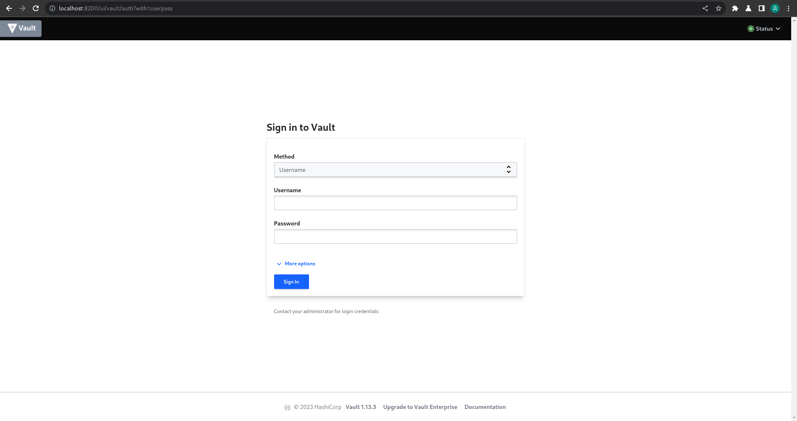

# itmo_distributed_systems_lab1

### 1. Запуск minikube

### 2. Написание конфигурации развертывания vault
 Директория содержит в себе файл `deployment.yaml`, в котором описана конфигурация развертывания сервиса vault, файл содержит в себе создание 2-х объектов k8s: deployment и service. Deployment содержит информацию об использованном образе и порте сервиса vault и создает pod с нашим сервисом, а объект service управляет доступом в данный pod и позволяет передавать в него запросы.

### 3. Запуск Vault
 С помощью команды

    minikube kubectl -- apply -f deployment.yaml
и

    minikube kubectl -- port-forward service/vault 8200:8200
 Запускается сервис vault на порту 8200

### Доступ к нему можно получить перейдя на
    http://localhost:8200

### 4. Авторизация в Vault
Для получения доступа нужен токен, который можно найти в в логах пода.
#### Способ 1:
  - получаем информацию о всех подах:

        minikube kubectl -- get pods
  - Копируем имя нашего пода vault и выполняем следующую команду:

        minikube kubectl -- logs <название пода> | grep "Root Token"
#### Способ 2:
 - Так-как в нашем deployment заданы labels и количество реплик 1, мы можем использовать следующую команду:

        minikube kubectl -- logs $(minikube kubectl -- get pods -l app.k8s/name=vault -o jsonpath='{.items[0].metadata.name}') | grep "Root Token"
    Условно говоря в данной команде мы получаем название первого пода с labels=app.k8s/name=vault и подставляем этот результат в kubectl logs

В обоих случаях результат должен быть одинаковый:

Используем полученный токен и авторизуемся в vault:

### Cхема:
