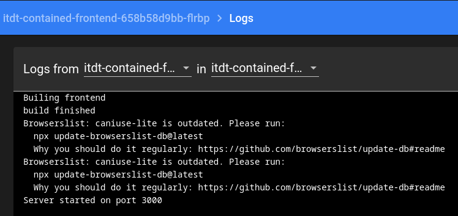
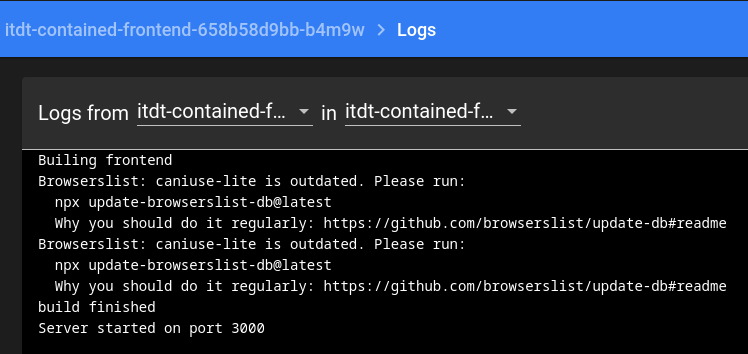
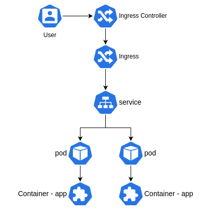

# itmo_distributed_systems_lab2

### Вводная часть
 Так-как целью данной лабораторной работы является показать возможности k8s по балансировке запросов, то для полноценной демонстрации данных возможностей понадобиться Ingress Controller, который бы принимал и обрабатывал внешние запросы. Поэтому для данной лабораторной я использовал уже готовый кластер k8s с развернутым Nginx Ingress Controller.
 Обычный minikube с использованием `port-forward` не позволяет продимонстировать данную возможность, так-как отправляет все запросы на первый под. Дополнительно можно воспользоваться возможностями `minikube service` и использовать тип service `LoadBalancer`, но я хотел бы продемонстировать это решение, как если бы мы работали в реальном кластере k8s.

### 1. Создание манифеста
 Директория содержит в себе файл `deployment.yaml`, в котором описана конфигурация развертывания веб-сервиса, файл содержит в себе создание 3-х объектов k8s: deployment, service и ingress. Deployment содержит информацию об использованном образе, количестве реплик, порте и заданных переменных веб-сервиса, на основе чего создает 2 реплики pod'а с веб-сервисом. Объект service управляет доступом в данные pod'ы и позволяет передавать в них запросы и получать данные. Ingress описывает конфигурацию, с которой внешние запросы к кластеру будут приниматься и отправляться запросы на service, в частности это то, с каким доменным именем, путем, портом и протоколом будут обработаны запросы.

### 2. Запуск развертывания веб-сервиса
 С помощью следующей команды на API k8s кластера отправляется информация о том, что необходимо создать:

    kubectl apply -f deployment.yaml

 Так мы получим 2 запущенные реплики pod'а с веб-сервисом:

 В созданном объекте ingress указан hostname Доступ к нему можно получить перейдя на http://app.itmo.blinov.da, предварительно добавив DNS запись с таким адресом (В моем случае она указывает на gateway кластера, где HAproxy все HTTP/HTTPS запросы передает на Ingress Controller Nginx)

 
 Здесь мы видим заданные в deployment значения, а именно `user: blinov.da` и `company: itmo` - они задаются сразу для всех реплик. 

### 3. Балансировка запросов
 K8S из коробки сразу балансирует запросы между рекликами pod'ов. При переходе на страницу, запрос падает на одну из двух реплик, чтобы понять на какую именнно развернутое приложение сообщает на странице информацию о названии контейнера, в котором оно развернуто и его IP внутри кластера. Эти значения можно сравнить со скришотом запущенных pod'ов - они должны совпадать с одним из них. Повторный запрос на страницу может попасть на тот же самый pod, а может на другой, следует попробовать несколько раз обновить страницу и следить за информацией о контейнере.
 
 На скришоте ниже видно, что в данный момент запрос попал на второй pod.

### 4. Логи
 #### Pod: itdt-contained-frontend-658b58d9bb-flrbp
 
 #### Pod: itdt-contained-frontend-658b58d9bb-b4m9w
 

### 5. Схема

