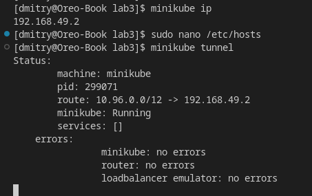
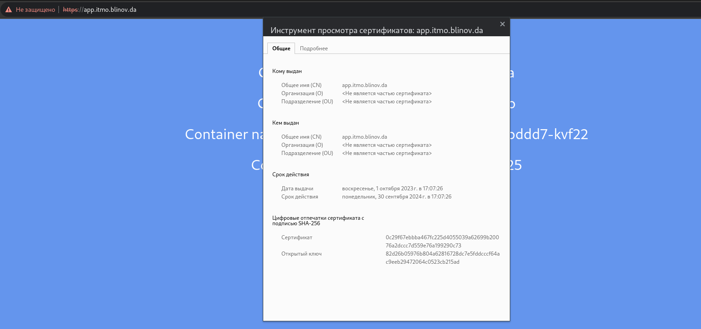
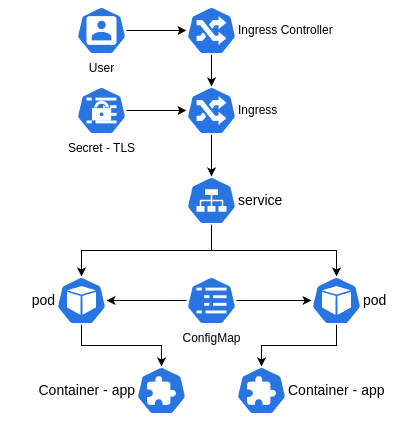

University: [ITMO University](https://itmo.ru/ru/) \
Faculty: [FICT](https://fict.itmo.ru) \
Course: [Introduction to distributed technologies](https://github.com/itmo-ict-faculty/introduction-to-distributed-technologies) \
Year: 2023/2024 \
Group: K4113с \
Author: Blinov Dmitry Andreevich \
Lab: Lab3 \
Date of create: 30.09.2023 \
Date of finished: <none>
#

### 1. Создание манифеста
 Директория содержит в себе файл `deployment.yaml`, в котором описана конфигурация развертывания веб-сервиса, файл содержит в себе создание 4-х объектов k8s: namespace, configMap, deployment, service и ingress.
 
 `Namespace` - пространство k8s, в котором будут создаваться наши последующие объекты, в данном примере он называется `itmo`.
 
 `ConfigMap` - файл конфигурации, содержащий в данном примере переменные окружения, которые буду применены к запускаемым контейнерам. В данном случае созданная configMap содержит в себе уже указанные переменные: `REACT_APP_USERNAME: 'blinov.da'` и `REACT_APP_COMPANY_NAME: 'itmo'`.
 
 `Deployment` содержит информацию об использованном образе, количестве реплик, порте и источнике конфигурации (configMap) веб-сервиса, на основе чего создает 2 реплики pod'а с веб-сервисом.
 
 `Service` управляет доступом в данные pod'ы и позволяет передавать в них запросы и получать данные.
 
 `Ingress` описывает конфигурацию, с которой внешние запросы к кластеру будут приниматься и отправляться к service'у, в частности это то, с каким доменным именем, путем, портом и протоколом будут обработаны запросы, а также в нем описан источник SSL-сертификатов, активирован TLS для указанного хоста и включен редирект с HTTP на HTTPS.

### 2. Активация Ingress в minikube
 С помощью следующей команды будет развернут Ingress Controller Nginx в minikube:

    minikube addons enable ingress

### 3. Добавление TLS
 Ingress Controller Nginx может использовать по умолчанию и собственные  SSL-сертификаты, но в данной работе мы сгенерируем свой сертификат и добавим его.
 
 Генерируем сертификат (обратите внимание на `CN`, в примере используется hostname `app.itmo.blinov.da`):
   
    openssl req -x509 -nodes -days 365 -newkey rsa:2048 -keyout tls.key -out tls.crt -subj "/CN=app.itmo.blinov.da

 Добавляем сгененированный сертификат в наш namespace `itmo` в k8s с помощью специального типа `Secret - tls`:

    kubectl create -n itmo secret tls app.itmo.blinov.da-tls --key="tls.key" --cert="tls.crt"

### 4. Запуск развертывания веб-сервиса
 С помощью следующей команды запускаем развертывание веб-сервиса:

    kubectl apply -f deployment.yaml

Проверим, что у нас существует все, что нам нужно:

    kubectl get all -n itmo && kubectl get configmaps -n itmo && kubectl get secrets -n itmo && kubectl get ingress -n itmo

 

 Доступ к развернутому веб-сервису можно получить используя указанный в ingress `hostname`, запустив `minikube tunnel` и перейдя на http://app.itmo.blinov.da, предварительно добавив `DNS` запись в `/etc/hosts` на ip-адрес `minikube`:

 Запустили minikube tunnel:

  

 И перейдем на http://app.itmo.blinov.da, должен произойти редирект на HTTPS. Соглашаемся открыть страницу с недоверенным сертификатом и страница развернутого веб-сервиса доступна:

 
 
 На странице мы видим заданные в configMap и примененные в deployment значения переменных, а именно `user: blinov.da` и `company: itmo` - они задаются сразу для всех реплик.

 Проверим сертификат:

 

 Видим, что используется тот самый выпущенный на 3 этапе сертификат.

 ### 5. Схема
 
 