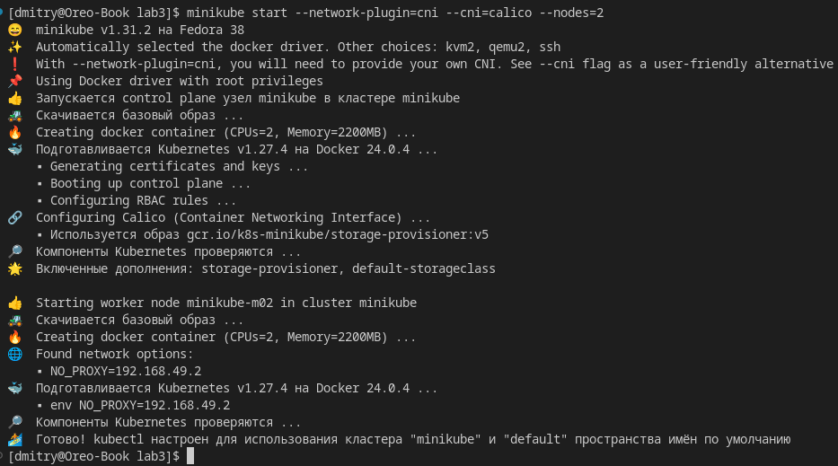
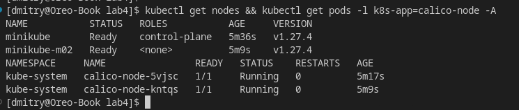
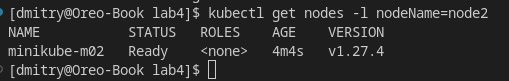
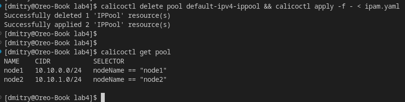
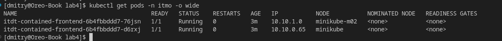
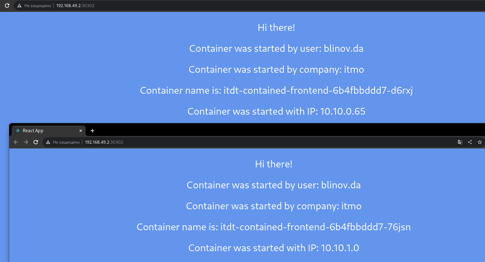
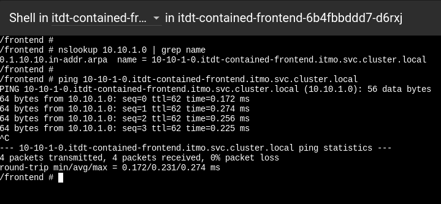
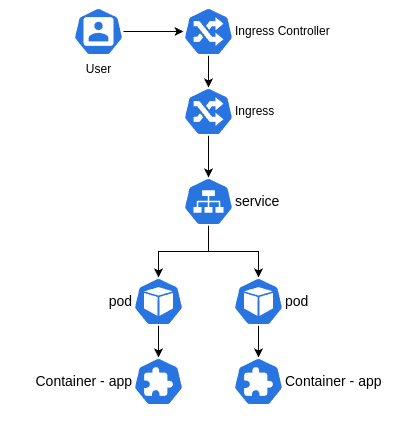

University: [ITMO University](https://itmo.ru/ru/) \
Faculty: [FICT](https://fict.itmo.ru) \
Course: [Introduction to distributed technologies](https://github.com/itmo-ict-faculty/introduction-to-distributed-technologies) \
Year: 2023/2024 \
Group: K4113с \
Author: Blinov Dmitry Andreevich \
Lab: Lab4 \
Date of create: 30.09.2023 \
Date of finished: <none>
#

### 1. Запуск minikube
 Запускаем minikube с CNI Calico и двумя нодами:

    minikube start --network-plugin=cni --cni=calico --nodes=2

 

 Проверим количество нод и подов calico (их должно быть одинаковое количество, по поду на ноду):

     kubectl get nodes && kubectl get pods -l k8s-app=calico-node -A

 

### 2. Настройка IPAM
 Зададим метки нодам с помощью манифества в файле `node.yaml`, он установит для ноды `minikube` метку `nodeName=node1`, а для `minikube-m02` метку `nodeName=node2`
    
    kubectl apply -f node.yaml

 Проверим наши метки:
 
 
 Далее удалим существующий стандартный IPPool и создадим для каждой ноды собственный, основываясь на их метках. Манифест для новых IPPOOL'ов описан в файле `ipam.yaml`. Запустим команду чтобы сделать это:

    calicoctl delete pool default-ipv4-ippool && calicoctl apply -f - < ipam.yaml

 

 Создались два IPPool с указанными селекторами меток для нод.
 В данном примере для первой ноды `minikube` мы использовали pool: `10.10.0.0/24`, а для второй - `minikube-m02`, использовали `10.10.1.0/24`

### 3. Создание манифеста для веб-сервиса
 Директория содержит в себе файл `deployment.yaml`, в котором описана конфигурация развертывания веб-сервиса, файл содержит в себе создание 4-х объектов k8s: namespace, configMap, deployment, service и ingress.
 
 `Namespace` - пространство k8s, в котором будут создаваться наши последующие объекты, в данном примере он называется `itmo`.
 
 `ConfigMap` - конфигурация, содержащая в данном примере переменные окружения, которые буду применены к запускаемым контейнерам. В данном случае созданная configMap содержит в себе уже указанные переменные: `REACT_APP_USERNAME: 'blinov.da'` и `REACT_APP_COMPANY_NAME: 'itmo'`.
 
 `Deployment` содержит информацию об использованном образе, количестве реплик, порте и источнике конфигурации (configMap) веб-сервиса, на основе чего создает 2 реплики pod'а с веб-сервисом.
 
 `Service` управляет доступом в данные pod'ы и позволяет передавать в них запросы и получать данные.

### 5. Запуск развертывания веб-сервиса
 С помощью следующей команды запускаем развертывание веб-сервиса:

    kubectl apply -f deployment.yaml

 Проверим развернутые поды - они должны развернуться на каждой из нод и быть в ранее созданных IPPool'ах:

 

 Так и есть!
 
 Проверим сам веб-сервис. Выполним:

    minikube service -n itmo itdt-contained-frontend

 На открывшейся странице мы видим заданные в `configMap` значения, а именно `user: blinov.da` и `company: itmo` - они задаются сразу для всех реплик.

 В данной работе нас интересует IP адрес контейнера, при обновлении страницы они должны меняться, в зависимости от пода, на который попал запрос, а все отображаемые IP адреса соответствуют созданным в данной работе IPPool'ам.

  

 ### 5. Ping
 Проверим ping из одного пода в другой:
 

 ### 5. Схема
 